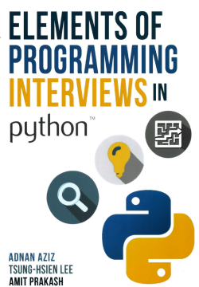

# Elements of Programming Interviews - Python
## My solutions & notes from Elements of Programming Interviews Python

## Chapter-wise check-list of Problems with Solution 
- [ ] Chapter 5: Primitives
    - [ ] [ Bootcamp: Primitive Types ]( /solutions/count_bits.py )
    - [ ] [ Computing the parity of a word ]( /solutions/parity.py )
    - [ ] [ Swap bits ]( /solutions/swap\_bits.py )
    - [ ] [ Reverse bits ]( /solutions/reverse\_bits.py )
    - [ ] [ Find a closest integer with the same weight ]( /solutions/closest\_int\_same\_weight.py )
    - [ ] [ Compute x * y without arithmetical operators ]( /solutions/primitive\_multiply.py )
    - [ ] [ Compute x/y ]( /solutions/primitive\_divide.py )
    - [ ] [ Compute x^y ]( /solutions/power\_x\_y.py )
    - [ ] [ Reverse digits ]( /solutions/reverse\_digits.py )
    - [ ] [ Check if a decimal integer is a palindrome ]( /solutions/is\_number\_palindromic.py )
    - [ ] [ Generate uniform random numbers ]( /solutions/uniform\_random\_number.py )
    - [ ] [ Rectangle intersection ]( /solutions/rectangle\_intersection.py )
- [ ] Chapter 6: Arrays
    - [ ] [ Bootcamp: Arrays ]( /solutions/even\_odd\_array.py )
    - [ ] [ The Dutch national flag problem ]( /solutions/dutch\_national\_flag.py )
    - [ ] [ Increment an arbitrary-precision integer ]( /solutions/int\_as\_array\_increment.py )
    - [ ] [ Multiply two arbitrary-precision integers ]( /solutions/int\_as\_array\_multiply.py )
    - [ ] [ Advancing through an array ]( /solutions/advance\_by\_offsets.py )
    - [ ] [ Delete duplicates from a sorted array ]( /solutions/sorted\_array\_remove\_dups.py )
    - [ ] [ Buy and sell a stock once ]( /solutions/buy\_and\_sell\_stock.py )
    - [ ] [ Buy and sell a stock twice ]( /solutions/buy\_and\_sell\_stock\_twice.py )
    - [ ] [ Computing an alternation ]( /solutions/alternating\_array.py )
    - [ ] [ Enumerate all primes to n ]( /solutions/prime\_sieve.py )
    - [ ] [ Permute the elements of an array ]( /solutions/apply\_permutation.py )
    - [ ] [ Compute the next permutation ]( /solutions/next\_permutation.py )
    - [ ] [ Sample offline data ]( /solutions/offline\_sampling.py )
    - [ ] [ Sample online data ]( /solutions/online\_sampling.py )
    - [ ] [ Compute a random permutation ]( /solutions/random\_permutation.py )
    - [ ] [ Compute a random subset ]( /solutions/random\_subset.py )
    - [ ] [ Generate nonuniform random numbers ]( /solutions/nonuniform\_random\_number.py )
    - [ ] [ The Sudoku checker problem ]( /solutions/is\_valid\_sudoku.py )
    - [ ] [ Compute the spiral ordering of a 2D array ]( /solutions/spiral\_ordering\_segments.py )
    - [ ] [ Rotate a 2D array ]( /solutions/matrix\_rotation.py )
    - [ ] [ Compute rows in Pascal's Triangle ]( /solutions/pascal\_triangle.py )
- [ ] Chapter 7: Strings
    - [ ] [ Interconvert strings and integers ]( /solutions/string\_integer\_interconversion.py )
    - [ ] [ Base conversion ]( /solutions/convert\_base.py )
    - [ ] [ Compute the spreadsheet column encoding ]( /solutions/spreadsheet\_encoding.py )
    - [ ] [ Replace and remove ]( /solutions/replace\_and\_remove.py )
    - [ ] [ Test palindromicity ]( /solutions/is\_string\_palindromic\_punctuation.py )
    - [ ] [ Reverse all the words in a sentence ]( /solutions/reverse\_words.py )
    - [ ] [ Compute all mnemonics for a phone number ]( /solutions/phone\_number\_mnemonic.py )
    - [ ] [ The look-and-say problem ]( /solutions/look\_and\_say.py )
    - [ ] [ Convert from Roman to decimal ]( /solutions/roman\_to\_integer.py )
    - [ ] [ Compute all valid IP addresses ]( /solutions/valid\_ip\_addresses.py )
    - [ ] [ Write a string sinusoidally ]( /solutions/snake\_string.py )
    - [ ] [ Implement run-length encoding ]( /solutions/run\_length\_compression.py )
    - [ ] [ Find the first occurrence of a substring ]( /solutions/substring\_match.py )
- [ ] Chapter 8: Linked Lists
    - [ ] [ Bootcamp: Linked Lists ]( /solutions/search\_in\_list.py )
    - [ ] [ Bootcamp: Linked Lists ]( /solutions/insert\_in\_list.py )
    - [ ] [ Bootcamp: Linked Lists ]( /solutions/delete\_from\_list.py )
    - [x] [ Merge two sorted lists ]( /solutions/sorted\_lists\_merge.py )
    - [ ] [ Reverse a single sublist ]( /solutions/reverse\_sublist.py )
    - [ ] [ Test for cyclicity ]( /solutions/is\_list\_cyclic.py )
    - [ ] [ Test for overlapping lists - lists are cycle-free ]( /solutions/do\_terminated\_lists\_overlap.py )
    - [ ] [ Test for overlapping lists - lists may have cycles ]( /solutions/do\_lists\_overlap.py )
    - [ ] [ Delete a node from a singly linked list ]( /solutions/delete\_node\_from\_list.py )
    - [ ] [ Remove the kth last element from a list ]( /solutions/delete\_kth\_last\_from\_list.py )
    - [ ] [ Remove duplicates from a sorted list ]( /solutions/remove\_duplicates\_from\_sorted\_list.py )
    - [ ] [ Implement cyclic right shift for singly linked lists ]( /solutions/list\_cyclic\_right\_shift.py )
    - [ ] [ Implement even-odd merge ]( /solutions/even\_odd\_list\_merge.py )
    - [ ] [ Test whether a singly linked list is palindromic ]( /solutions/is\_list\_palindromic.py )
    - [ ] [ Implement list pivoting ]( /solutions/pivot\_list.py )
    - [ ] [ Add list-based integers ]( /solutions/int\_as\_list\_add.py )
- [ ] Chapter 9: Stacks and Queues
    - [ ] [ Implement a stack with max API ]( /solutions/stack\_with\_max.py )
    - [x] [ Evaluate RPN expressions ]( /solutions/evaluate\_rpn.py )
    - [x] [ Test a string over for well-formedness ]( /solutions/is\_valid\_parenthesization.py )
    - [ ] [ Normalize pathnames ]( /solutions/directory\_path\_normalization.py )
    - [ ] [ Compute buildings with a sunset view ]( /solutions/sunset\_view.py )
    - [ ] [ Compute binary tree nodes in order of increasing depth ]( /solutions/tree\_level\_order.py )
    - [ ] [ Implement a circular queue ]( /solutions/circular\_queue.py )
    - [x] [ Implement a queue using stacks ]( /solutions/queue\_from\_stacks.py )
    - [ ] [ Implement a queue with max API ]( /solutions/queue\_with\_max.py )
- [ ] Chapter 10: Binary Trees
    - [x] [ Test if a binary tree is height-balanced ]( /solutions/is\_tree\_balanced.py )
    - [ ] [ Test if a binary tree is symmetric ]( /solutions/is\_tree\_symmetric.py )
    - [ ] [ Compute the lowest common ancestor in a binary tree ]( /solutions/lowest\_common\_ancestor.py )
    - [ ] [ Compute the LCA when nodes have parent pointers ]( /solutions/lowest\_common\_ancestor\_with\_parent.py )
    - [ ] [ Sum the root-to-leaf paths in a binary tree ]( /solutions/sum\_root\_to\_leaf.py )
    - [ ] [ Find a root to leaf path with specified sum ]( /solutions/path\_sum.py )
    - [x] [ Implement an inorder traversal without recursion ]( /solutions/tree\_inorder.py )
    - [x] [ Implement a preorder traversal without recursion ]( /solutions/tree\_preorder.py )
    - [ ] [ Compute the kth node in an inorder traversal ]( /solutions/kth\_node\_in\_tree.py )
    - [ ] [ Compute the successor ]( /solutions/successor\_in\_tree.py )
    - [ ] [ Implement an inorder traversal with O(1) space ]( /solutions/tree\_with\_parent\_inorder.py )
    - [x] [ Reconstruct a binary tree from traversal data ]( /solutions/tree\_from\_preorder\_inorder.py )
    - [ ] [ Reconstruct a binary tree from a preorder traversal with markers ]( /solutions/tree\_from\_preorder\_with\_null.py )
    - [ ] [ Form a linked list from the leaves of a binary tree ]( /solutions/tree\_connect\_leaves.py )
    - [ ] [ Compute the exterior of a binary tree ]( /solutions/tree\_exterior.py )
    - [ ] [ Compute the right sibling tree ]( /solutions/tree\_right\_sibling.py )
- [ ] Chapter 11: Heaps
    - [ ] [ Merge sorted files ]( /solutions/sorted\_arrays\_merge.py )
    - [ ] [ Sort an increasing-decreasing array ]( /solutions/sort\_increasing\_decreasing\_array.py )
    - [ ] [ Sort an almost-sorted array ]( /solutions/sort\_almost\_sorted\_array.py )
    - [ ] [ Compute the k closest stars ]( /solutions/k\_closest\_stars.py )
    - [ ] [ Compute the median of online data ]( /solutions/online\_median.py )
    - [ ] [ Compute the k largest elements in a max-heap ]( /solutions/k\_largest\_in\_heap.py )
- [ ] Chapter 12: Searching
    - [ ] [ Search a sorted array for first occurrence of k ]( /solutions/search\_first\_key.py )
    - [ ] [ Search a sorted array for entry equal to its index ]( /solutions/search\_entry\_equal\_to\_index.py )
    - [ ] [ Search a cyclically sorted array ]( /solutions/search\_shifted\_sorted\_array.py )
    - [ ] [ Compute the integer square root ]( /solutions/int\_square\_root.py )
    - [ ] [ Compute the real square root ]( /solutions/real\_square\_root.py )
    - [ ] [ Search in a 2D sorted array ]( /solutions/search\_row\_col\_sorted\_matrix.py )
    - [ ] [ Find the min and max simultaneously ]( /solutions/search\_for\_min\_max\_in\_array.py )
    - [ ] [ Find the kth largest element ]( /solutions/kth\_largest\_in\_array.py )
    - [ ] [ Find the missing IP address ]( /solutions/absent\_value\_array.py )
    - [ ] [ Find the duplicate and missing elements ]( /solutions/search\_for\_missing\_element.py )
- [ ] Chapter 13: Hash Tables
    - [ ] [ Bootcamp: Hash Tables ]( /solutions/anagrams.py )
    - [ ] [ Test for palindromic permutations ]( /solutions/is\_string\_permutable\_to\_palindrome.py )
    - [ ] [ Is an anonymous letter constructible? ]( /solutions/is\_anonymous\_letter\_constructible.py )
    - [ ] [ Implement an ISBN cache ]( /solutions/lru\_cache.py )
    - [ ] [ Compute the LCA optimizing for close ancestors ]( /solutions/lowest\_common\_ancestor\_close\_ancestor.py )
    - [ ] [ Find the nearest repeated entries in an array ]( /solutions/nearest\_repeated\_entries.py )
    - [ ] [ Find the smallest subarray covering all values ]( /solutions/smallest\_subarray\_covering\_set.py )
    - [ ] [ Find smallest subarray sequentially covering all values ]( /solutions/smallest\_subarray\_covering\_all\_values.py )
    - [ ] [ Find the longest subarray with distinct entries ]( /solutions/longest\_subarray\_with\_distinct\_values.py )
    - [ ] [ Find the length of a longest contained interval ]( /solutions/longest\_contained\_interval.py )
    - [ ] [ Compute all string decompositions ]( /solutions/string\_decompositions\_into\_dictionary\_words.py )
    - [ ] [ Test the Collatz conjecture ]( /solutions/collatz\_checker.py )
- [ ] Chapter 14: Sorting
    - [ ] [ Compute the intersection of two sorted arrays ]( /solutions/intersect\_sorted\_arrays.py )
    - [ ] [ Merge two sorted arrays ]( /solutions/two\_sorted\_arrays\_merge.py )
    - [ ] [ Computing the h-index ]( /solutions/h\_index.py )
    - [ ] [ Remove first-name duplicates ]( /solutions/remove\_duplicates.py )
    - [ ] [ Smallest nonconstructible value ]( /solutions/smallest\_nonconstructible\_value.py )
    - [ ] [ Render a calendar ]( /solutions/calendar\_rendering.py )
    - [ ] [ Merging intervals ]( /solutions/interval\_add.py )
    - [ ] [ Compute the union of intervals ]( /solutions/intervals\_union.py )
    - [ ] [ Partitioning and sorting an array with many repeated entries ]( /solutions/group\_equal\_entries.py )
    - [ ] [ Team photo day - 1 ]( /solutions/is\_array\_dominated.py )
    - [ ] [ Implement a fast sorting algorithm for lists ]( /solutions/sort\_list.py )
    - [ ] [ Compute a salary threshold ]( /solutions/find\_salary\_threshold.py )
- [ ] Chapter 15: Binary Search Trees
    - [x] [ Test if a binary tree satisfies the BST property ]( /solutions/is\_tree\_a\_bst.py )
    - [x] [ Find the first key greater than a given value in a BST ]( /solutions/search\_first\_greater\_value\_in\_bst.py )
    - [ ] [ Find the k largest elements in a BST ]( /solutions/k\_largest\_values\_in\_bst.py )
    - [ ] [ Compute the LCA in a BST ]( /solutions/lowest\_common\_ancestor\_in\_bst.py )
    - [ ] [ Reconstruct a BST from traversal data ]( /solutions/bst\_from\_preorder.py )
    - [ ] [ Find the closest entries in three sorted arrays ]( /solutions/minimum\_distance\_3\_sorted\_arrays.py )
    - [ ] [ Enumerate numbers of the form a + b sqrt(2) ]( /solutions/a\_b\_sqrt2.py )
    - [x] [ Build a minimum height BST from a sorted array ]( /solutions/bst\_from\_sorted\_array.py )
    - [ ] [ Test if three BST nodes are totally ordered ]( /solutions/descendant\_and\_ancestor\_in\_bst.py )
    - [ ] [ The range lookup problem ]( /solutions/range\_lookup\_in\_bst.py )
    - [ ] [ Add credits ]( /solutions/adding\_credits.py )
- [ ] Chapter 16: Recursion
    - [ ] [ The Towers of Hanoi problem ]( /solutions/hanoi.py )
    - [ ] [ Generate all nonattacking placements of n-Queens ]( /solutions/n\_queens.py )
    - [ ] [ Generate permutations ]( /solutions/permutations.py )
    - [ ] [ Generate the power set ]( /solutions/power\_set.py )
    - [ ] [ Generate all subsets of size k ]( /solutions/combinations.py )
    - [ ] [ Generate strings of matched parens ]( /solutions/enumerate\_balanced\_parentheses.py )
    - [ ] [ Generate palindromic decompositions ]( /solutions/enumerate\_palindromic\_decompositions.py )
    - [ ] [ Generate binary trees ]( /solutions/enumerate\_trees.py )
    - [ ] [ Implement a Sudoku solver ]( /solutions/sudoku\_solve.py )
    - [ ] [ Compute a Gray code ]( /solutions/gray\_code.py )
- [ ] Chapter 17: Dynamic Programming
    - [ ] [ Bootcamp: Dynamic Programming ]( /solutions/fibonacci.py )
    - [ ] [ Bootcamp: Dynamic Programming ]( /solutions/max\_sum\_subarray.py )
    - [ ] [ Count the number of score combinations ]( /solutions/number\_of\_score\_combinations.py )
    - [ ] [ Compute the Levenshtein distance ]( /solutions/levenshtein\_distance.py )
    - [ ] [ Count the number of ways to traverse a 2D array ]( /solutions/number\_of\_traversals\_matrix.py )
    - [ ] [ Compute the binomial coefficients ]( /solutions/binomial\_coefficients.py )
    - [ ] [ Search for a sequence in a 2D array ]( /solutions/is\_string\_in\_matrix.py )
    - [ ] [ The knapsack problem ]( /solutions/knapsack.py )
    - [ ] [ The bedbathandbeyond.com problem ]( /solutions/is\_string\_decomposable\_into\_words.py )
    - [ ] [ Find the minimum weight path in a triangle ]( /solutions/minimum\_weight\_path\_in\_a\_triangle.py )
    - [ ] [ Pick up coins for maximum gain ]( /solutions/picking\_up\_coins.py )
    - [ ] [ Count the number of moves to climb stairs ]( /solutions/number\_of\_traversals\_staircase.py )
    - [ ] [ The pretty printing problem ]( /solutions/pretty\_printing.py )
    - [ ] [ Find the longest nondecreasing subsequence ]( /solutions/longest\_nondecreasing\_subsequence.py )
- [ ] Chapter 18: Greedy Algorithms and Invariants
    - [x] [ Compute an optimum assignment of tasks ]( /solutions/task\_pairing.py )
    - [x] [ Schedule to minimize waiting time ]( /solutions/minimum\_waiting\_time.py )
    - [x] [ The interval covering problem ]( /solutions/minimum\_points\_covering\_intervals.py )
    - [ ] [ The interval covering problem ]( /solutions/two\_sum.py )
    - [ ] [ The 3-sum problem ]( /solutions/three\_sum.py )
    - [ ] [ Find the majority element ]( /solutions/majority\_element.py )
    - [ ] [ The gasup problem ]( /solutions/refueling\_schedule.py )
    - [ ] [ Compute the maximum water trapped by a pair of vertical lines ]( /solutions/max\_trapped\_water.py )
    - [ ] [ Compute the largest rectangle under the skyline ]( /solutions/largest\_rectangle\_under\_skyline.py )
- [ ] Chapter 19: Graphs
    - [ ] [ Search a maze ]( /solutions/search\_maze.py )
    - [ ] [ Paint a Boolean matrix ]( /solutions/matrix\_connected\_regions.py )
    - [ ] [ Compute enclosed regions ]( /solutions/matrix\_enclosed\_regions.py )
    - [ ] [ Deadlock detection ]( /solutions/deadlock\_detection.py )
    - [ ] [ Clone a graph ]( /solutions/graph\_clone.py )
    - [ ] [ Making wired connections ]( /solutions/is\_circuit\_wirable.py )
    - [ ] [ Transform one string to another ]( /solutions/string\_transformability.py )
    - [ ] [ Team photo day - 2 ]( /solutions/max\_teams\_in\_photograph.py )
- [ ] Chapter 20: Parallel Computing
- [ ] Chapter 24: Honors Class
    - [ ] [ Compute the greatest common divisor ]( /solutions/gcd.py )
    - [ ] [ Find the first missing positive entry ]( /solutions/first\_missing\_positive\_entry.py )
    - [ ] [ Buy and sell a stock k times ]( /solutions/buy\_and\_sell\_stock\_k\_times.py )
    - [ ] [ Compute the maximum product of all entries but one ]( /solutions/max\_product\_all\_but\_one.py )
    - [ ] [ Compute the longest contiguous increasing subarray ]( /solutions/longest\_increasing\_subarray.py )
    - [ ] [ Rotate an array ]( /solutions/rotate\_array.py )
    - [ ] [ Identify positions attacked by rooks ]( /solutions/rook\_attack.py )
    - [ ] [ Justify text ]( /solutions/left\_right\_justify\_text.py )
    - [ ] [ Implement list zipping ]( /solutions/zip\_list.py )
    - [ ] [ Copy a postings list ]( /solutions/copy\_posting\_list.py )
    - [ ] [ Compute the longest substring with matching parens ]( /solutions/longest\_substring\_with\_matching\_parentheses.py )
    - [ ] [ Compute the maximum of a sliding window ]( /solutions/max\_of\_sliding\_window.py )
    - [ ] [ Implement a postorder traversal without recursion ]( /solutions/tree\_postorder.py )
    - [ ] [ Compute fair bonuses ]( /solutions/bonus.py )
    - [ ] [ Search a sorted array of unknown length ]( /solutions/search\_unknown\_length\_array.py )
    - [ ] [ Search in two sorted arrays ]( /solutions/kth\_largest\_element\_in\_two\_sorted\_arrays.py )
    - [ ] [ Find the kth largest element - large n small k]( /solutions/kth\_largest\_element\_in\_long\_array.py )
    - [ ] [ Find an element that appears only once ]( /solutions/element\_appearing\_once.py )
    - [ ] [ Find the line through the most points ]( /solutions/line\_through\_most\_points.py )
    - [ ] [ Convert a sorted doubly linked list into a BST ]( /solutions/sorted\_list\_to\_bst.py )
    - [ ] [ Convert a BST to a sorted doubly linked list ]( /solutions/bst\_to\_sorted\_list.py )
    - [ ] [ Merge two BSTs ]( /solutions/bst\_merge.py )
    - [ ] [ Implement regular expression matching ]( /solutions/regular\_expression.py )
    - [ ] [ Synthesize an expression ]( /solutions/insert\_operators\_in\_string.py )
    - [ ] [ Count inversions ]( /solutions/count\_inversions.py )
    - [ ] [ Draw the skyline ]( /solutions/drawing\_skyline.py )
    - [ ] [ Measure with defective jugs ]( /solutions/defective\_jugs.py )
    - [ ] [ Compute the maximum subarray sum in a circular array ]( /solutions/maximum\_subarray\_in\_circular\_array.py )
    - [ ] [ Determine the critical height ]( /solutions/max\_safe\_height.py )
    - [ ] [ Find the maximum 2D subarray ]( /solutions/max\_submatrix.py )
    - [ ] [ Find the maximum 2D subarray ]( /solutions/max\_square\_submatrix.py )
    - [ ] [ Implement Huffman coding ]( /solutions/huffman\_coding.py )
    - [ ] [ Trapping water ]( /solutions/max\_water\_trappable.py )
    - [ ] [ The heavy hitter problem ]( /solutions/search\_frequent\_items.py )
    - [ ] [ Find the longest subarray whose sum <=  k ]( /solutions/longest\_subarray\_with\_sum\_constraint.py )
    - [ ] [ Road network ]( /solutions/road\_network.py )
    - [ ] [ Test if arbitrage is possible ]( /solutions/arbitrage.py )
 
## Suggested usage:
+ Purchase Elements of Programming Interviews
+ Fork [EPIJudge](https://github.com/adnanaziz/EPIJudge.git) - get stub programs & test framework
+ Solve a problem & Program your solution to see if the test cases pass
+ Repeat previous two steps until no problems are left

## Dependencies:
+ Python 3 (for my solutions)